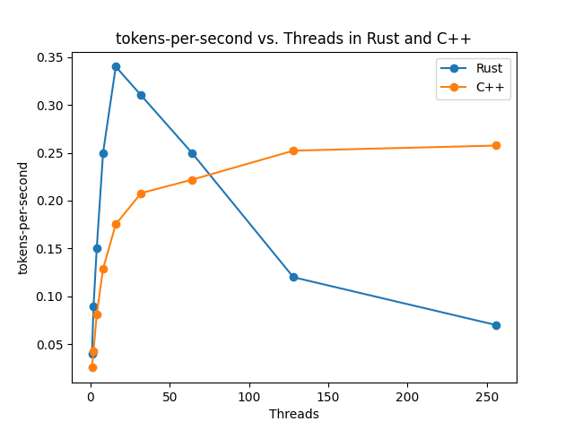
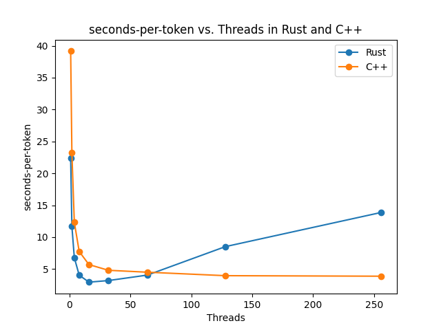
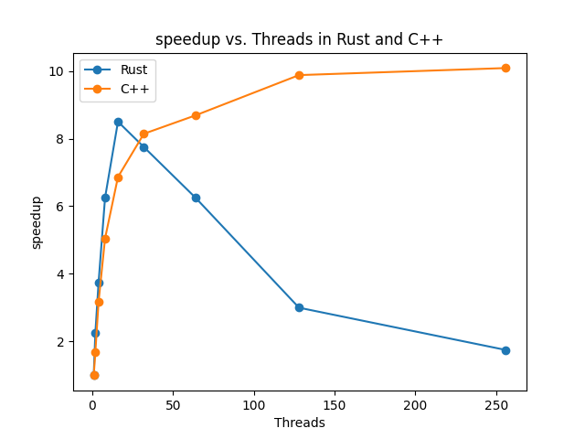

# gptx
A minimal implementation of GPT-2 in Rust and C++.

## About
This is a barebones implemenation of GPT-2 in Rust and C++. We also implement a minimal Tensor Library for the same. Currently, this only supports inference on the GPT-2 model with float32 weights on CPU. 

## Install

1. If you're at NYU CS, you can first setup the enviroment on Crunchy1. For rust, you need to install cargo if not already installed. For C++, you need to activate the right cmake and gcc. 
```bash
module load cmake-3
module load gcc-9.2

# install cargo
curl https://sh.rustup.rs -sSf | sh

# module load python-3.10
```


2. Download the weights using the code in python folder. If you cannot download the weights, you can create the weights using the code in the python folder.
```bash
cd python
wget -O model_weights.zip "https://www.dropbox.com/scl/fi/wvz1tk6e34s7jhwbsmo46/model_weights.zip?rlkey=7b1mu9qsn1y593u64awpglmyz&dl=0"
unzip model_weights.zip

# pip install -r requirements.txt
# python get_gpt_weights.py
```

3. For the rust implementation, use the -t for no. of threads, -n for no. of tokens to generate, and -m for the model path in json format.
```bash
cd rust;
cargo build --release;
./target/release/gptx -t 8 -n 20 -m ../python/model_weights.json
```

4. For the CPP implementation, the same commands apply.
```bash
cd cpp
mkdir build
cd build
cmake -DCMAKE_BUILD_TYPE=Release ..
make
./gptx -t 8 -n 20 -m ../../python/model_weights.json
```

## Benchmarking
After building the binaries for both the projects, run the scripts for the threads like in the `scripts` folder. 
```bash
cd rust
sh ../scripts/rust.sh
```
```bash
cd cpp
sh ../scripts/cpp.sh
```

Plot the results using the script in `python` folder. 
```bash
cd python
python plot_benchmarks.py
```

## Results
We experiment with parallelizing the tensor multiplications using multi-threading, using the rayon crate for rust and OpenMP for C++. 



